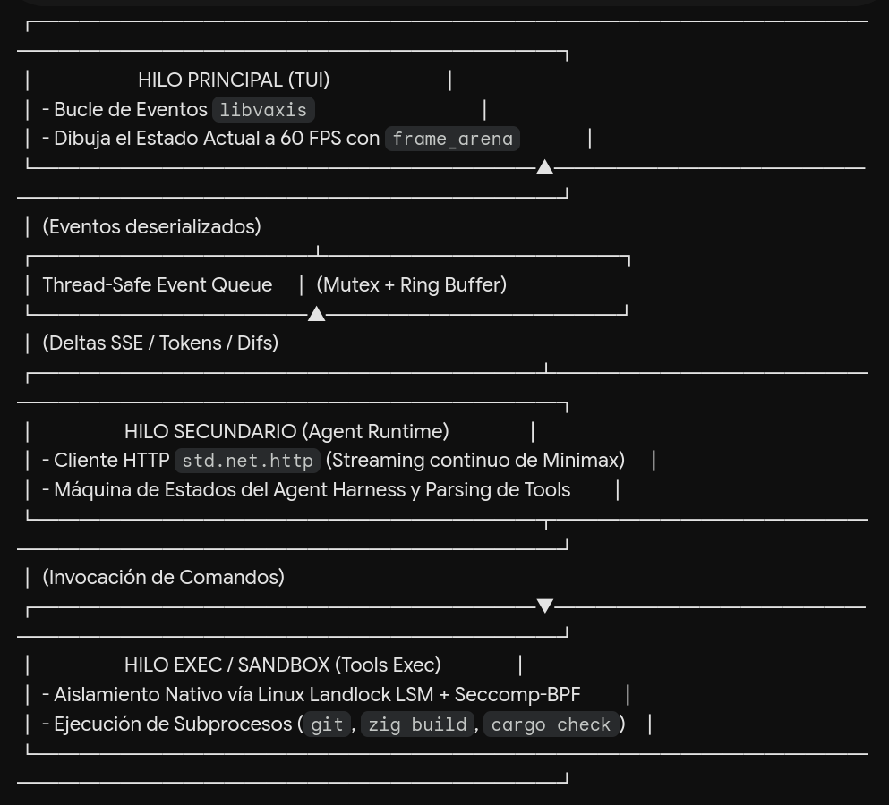

# zargeant

[](https://ziglang.org)
[](#license)
[](#status)

> **AI Harness TUI** — A terminal-native AI agent harness built in Zig with a least-privilege execution sandbox.

## What is zargeant?

Zargeant is a **terminal-native AI agent harness**: a TUI that lets you drive an LLM agent directly from your terminal, with strict security boundaries on every tool invocation. It is written in **Zig 0.16** with zero external runtime dependencies, built on three concurrent threads (TUI render / Agent HTTP-SSE / Tools subprocess pool) and a Linux sandbox based on **Landlock LSM + Seccomp-BPF**.

## Why?

- **Minimal binary.** Zig 0.16 + stdlib only; ~200 KB–1.5 MB stripped, cold start < 50 ms.
- **Hardened by design.** Every tool subprocess runs in a sandboxed copy of the agent's profile: deny-by-default filesystem rules via Landlock, syscall allowlist via Seccomp-BPF, no `ptrace`, no `mount`, no `bpf`.
- **Headless observability.** A mandatory `src/logger.zig` writes to `/tmp/ai-harness-debug.log` (mode `0600`). The TUI takes raw mode on the terminal; **no** writes to `stdout` or `stderr`.
- **Strict TDD.** Every slice ships with tests written **before** implementation. 500 tests pass on Debug + ReleaseSafe + ReleaseFast as of the terminal-control-lib-from-scratch PR 6 merge (386 main + 114 in-tree terminal).

## Architecture

```
                zargeant process
                       │
       ┌───────────────┼───────────────────────┐
       │               │                       │
   TUI thread      Agent thread          Tools subprocess
   (raw mode tty)  (HTTP-SSE)            (sandboxed)
       │               │                       │
       └─────────writes to───────────────► /tmp/ai-harness-debug.log
                                            (mode 0600, sticky file)

   Tool subprocess layer:
     ┌─────────────────────────────────────────┐
     │  Landlock ABI v1 (kernel 5.13+)         │
     │    writable: /tmp, ~/.config/zargeant  │
     │    read-only: /usr/lib, /lib, /etc/ssl │
     │  Seccomp-BPF                            │
     │    allow: read, write, openat, ...     │
     │    deny:  ptrace, mount, bpf, ...      │
     └─────────────────────────────────────────┘
```

Three threads:

1. **TUI render** — Owns the terminal in raw mode. Draws frames, handles keys. No network, no filesystem writes (logger aside).
2. **Agent HTTP-SSE** — Streams requests to the MiniMax API (`https://api.minimaxi.chat/v1/text/chatcompletion_v2`). Long-lived connection per turn.
3. **Tools subprocess pool** — Spawns each tool invocation in a `clone(2)` child. The child applies Landlock + Seccomp-BPF, then `execve(2)`s the tool binary. The parent collects the exit code via `waitpid(2)`.

## Status

In development. Five of seven planned slices are shipped on `main`:

| Slice                                                       | Status         | Lines  | Tests   |
| ----------------------------------------------------------- | -------------- | ------ | ------- |
| Build toolchain (`build.zig` + `zig.zon`)                   | ✓ shipped      | 78     | 1 smoke |
| Logger (`/tmp/ai-harness-debug.log`)                        | ✓ shipped      | 609    | 15      |
| Sandbox Linux (Landlock + Seccomp-BPF)                      | ✓ shipped      | 1,615  | 25      |
| API Client (MiniMax HTTP-SSE)                               | ✓ shipped      | ~900   | ~12     |
| TLS handrolled                                              | ✓ shipped      | ~700   | ~8      |
| TUI (in-tree `src/terminal/` + 3-thread orchestrator)       | 🚧 6-PR chain ready, awaiting merge | ~3,500 | 500   |
| logger-macos-port                                           | 📋 follow-up   | —      | —       |
| sandbox-macos                                               | 📋 follow-up   | —      | —       |

**Total**: 500 tests pass on `zig build test` (Debug + ReleaseSafe + ReleaseFast) as of the terminal-control-lib-from-scratch PR 6 merge. Slice 5 (TUI) is a 6-PR chained stack replacing the `mibu@636a36a` dependency with an in-tree `src/terminal/` module (per ADR 0001 §"Alternatives Considered" #2 + ADR 0003); see [Slice status — TUI](#slice-status--tui) below.

## Requirements

- **Zig 0.16.0** — exact toolchain pinned (post-0.16 `std.posix.*` wrappers stripped; we use `std.os.linux.*` raw syscalls).
- **Linux 5.13+** — Landlock ABI v1 is the floor. Tested on Arch Linux (kernel 6.x).
- **Zero third-party deps.** Everything links statically from Zig stdlib + in-tree modules. The `mibu@636a36a` TUI dependency was replaced by the in-tree `src/terminal/` module (per ADR 0003, closes ADR 0001 §"Alternatives Considered" #2).

## Dependencies

zargeant has zero third-party deps — the entire stack is in-tree or Zig stdlib. The full dep audit is in [CONTRIBUTING.md](CONTRIBUTING.md); the short version:

| Component             | Source                                        | License | Pin  |
| --------------------- | --------------------------------------------- | ------- | ---- |
| **TUI render**        | `src/terminal/` (in-tree, clean-room)         | Unlicense (project) | — |
| **HTTP**              | `src/api_client.zig` + `src/api_sse.zig` (internal) | — | — |
| **Crypto / TLS**      | `src/tls_conn.zig` (handrolled)               | —       | —    |
| **Sandbox**           | `src/sandbox_linux.zig` (Landlock LSM + Seccomp-BPF) | — | — |
| **Mock HTTP server**  | `src/mock_server.zig` (internal)              | —       | —    |
| **Logger**            | `src/logger.zig` → `/tmp/ai-harness-debug.log` (mode `0600`) | — | — |

The previous `mibu@636a36a` TUI dependency (per [ADR 0001](docs/decisions/0001-libvaxis-to-mibu.md)) has been replaced by the in-tree `src/terminal/` module implemented in [ADR 0003](docs/decisions/0003-clean-room-impl.md). No third-party TUI dep remains; the project owns the entire TUI surface.

To add a new third-party dep, write a new ADR under `docs/decisions/` first; see [CONTRIBUTING.md](CONTRIBUTING.md#no-new-third-party-deps-without-an-adr).

## Slice status — TUI

The TUI slice ships as a 6-PR chained stack on top of the `feat-tclib-tracker` branch (feature-branch-chain topology per `sdd/terminal-control-lib-from-scratch/tasks`). Each PR is its own PR against the previous PR branch; once all 6 land on `feat-tclib-tracker`, a final PR aggregates `feat-tclib-tracker` → `main`.

| PR       | Theme                                                                             | Status                       | PR                                                                       | LoC    |
| -------- | --------------------------------------------------------------------------------- | ---------------------------- | ------------------------------------------------------------------------ | ------ |
| PR 1     | Foundation + termios (ADR 0002 + `mod.zig` + `term.zig` + MockBackend + 6 tests)  | ✅ OPEN, MERGEABLE           | [#31](https://github.com/Kat404/Zargeant/pull/31)                         | +694   |
| PR 2     | Emit layer (cursor + style + dpm + kitty)                                        | ✅ OPEN, MERGEABLE           | [#32](https://github.com/Kat404/Zargeant/pull/32)                         | +935   |
| PR 3     | Event parser part 1 (UTF-8 + base + in-band resize unconditional + EINTR-pending) | ✅ OPEN, MERGEABLE           | [#33](https://github.com/Kat404/Zargeant/pull/33)                         | +1,336 |
| PR 4     | Event parser part 2 (kitty kb parser: CSI u + press/repeat/release + mods)        | ✅ OPEN, MERGEABLE           | [#34](https://github.com/Kat404/Zargeant/pull/34)                         | +358   |
| PR 5     | Probe response lexer (DECRPM reply + `Mode.supported()` + 4 failure modes per C14) | ✅ OPEN, MERGEABLE           | [#35](https://github.com/Kat404/Zargeant/pull/35)                         | +608   |
| PR 6     | Atomic swap + drop mibu (atomic `mibu → terminal` rename + ADR 0003)              | ✅ OPEN, MERGEABLE (FINAL)   | [#36](https://github.com/Kat404/Zargeant/pull/36)                         | +110   |

**What's next:** User merges PRs #31 → #32 → #33 → #34 → #35 → #36 in order to `feat-tclib-tracker`, then merges `feat-tclib-tracker` → `main`. The change is `sdd-verify PASS` + `sdd-archive OK` (cycle closed; see engram obs#1521 + obs#1522).

The full task breakdown (20 WUs across 6 PRs) lives in `sdd/terminal-control-lib-from-scratch/tasks` (obs#1514). The TUI design is in `sdd/terminal-control-lib-from-scratch/design` (obs#1512) and the spec in `sdd/terminal-control-lib-from-scratch/spec` (obs#1510). The libvaxis → mibu → in-tree decision chain: [ADR 0001](docs/decisions/0001-libvaxis-to-mibu.md) → [ADR 0002](docs/decisions/0002-clean-room.md) → [ADR 0003](docs/decisions/0003-clean-room-impl.md).

### Clean-room constraints (CONTRIBUTING.md:41 + ADR 0003 §Negative)

The in-tree `src/terminal/` module was implemented strictly against public specs:
- POSIX `termios(3)` — raw-mode lifecycle, `tcgetattr`/`tcsetattr`/`TIOCGWINSZ` ioctl
- ECMA-48 §CSI/§SGR — cursor positioning, SGR attributes
- xterm ctlseqs — DEC private modes 1049/2026/2048, DECRQM/DECRPM probes, in-band resize
- kitty keyboard protocol — push/pop + CSI `u` parsing with press/repeat/release + modifier carry

No `mibu` or `libvaxis` source code was consulted at any point during the implementation. The `src/tui.zig` byte stream is preserved byte-for-byte (verified by `tests/tui/cancel_path.zig` CAP-09 + `tests/tui/runtime_thread.zig` integration tests).

## Build

```bash
# Clone
git clone https://github.com/<your-org>/zargeant.git
cd zargeant

# Debug build (default)
zig build

# Run all tests (strict TDD enforced)
zig build test --summary all

# Production build (LTO + strip)
zig build -Doptimize=ReleaseFast

# Verify on all 3 optimization modes
zig build test --summary all
zig build test --summary all -Doptimize=ReleaseSafe
zig build test --summary all -Doptimize=ReleaseFast
```

Expected output: `500/500 tests passed` on each mode (386 main + 114 in-tree terminal via `test-terminal` step).

## Debugging

Pick the tool by what broke — overlap-free matrix:

| Symptom                         | Tool                                | Why                                      |
| ------------------------------- | ----------------------------------- | ---------------------------------------- |
| Syscall denied (BPF / Landlock) | `strace`                            | Only tool that sees `EPERM` from BPF     |
| Memory leak / use-after-free    | `zig build test-asan`¹              | ASan catches at first access             |
| Data race (3-thread model)      | `zig build test-tsan`¹              | TSan watches all threads                 |
| TLS handshake state             | `lldb` / `gdb`                      | Inspect Reader/Writer buffers, `poll(2)` |
| Hard leak ASan can't catch      | `valgrind --leak-check=full`        | Fallback; 10–30× slower                  |
| NFR-01 perf regression          | `perf record` + FlameGraph          | Sample-based, low overhead               |
| Crash post-mortem               | `lldb -c core ./zargeant`           | Walk stack from coredump                 |
| Runtime state (always)          | `tail -f /tmp/ai-harness-debug.log` | Project's own observability, mode `0600` |

¹ Requires a `test-asan` / `test-tsan` step in `build.zig` — TODO before slice 5 (TUI).

### Sandbox: syscall tracing

```bash
# Landlock + Seccomp denials (EPERM, EACCES)
strace -f -e trace=%landlock,%seccomp,bpf -o sandbox.log ./zig-out/bin/zargeant

# Watch the deny-list rules fire (ptrace, mount, bpf)
strace -f -e trace=ptrace,mount,bpf,clone3 -e signal='!SIGCHLD' ./zig-out/bin/zargeant
```

Use during `sandbox-linux` + `sandbox-macos` slices. A denied syscall that
should be allowed = missing rule in `src/sandbox_linux.zig`.

### Memory: valgrind

```bash
zig build -Doptimize=Debug
valgrind --leak-check=full --show-leak-kinds=all \
         --track-origins=yes ./zig-out/bin/zargeant
```

Use when `std.testing.allocator` reports a leak that the test runner can't
attribute, OR for the long-running Agent HTTP-SSE thread.

### Interactive: lldb / gdb

```bash
zig build -Doptimize=Debug    # keep DWARF, no strip
lldb ./zig-out/bin/zargeant
```

Use during `tls-handrolled` slice to inspect `std.crypto.tls.Client` state
mid-handshake, `poll(2)` fd readiness, or Reader/Writer buffer contents.

### Logs (always on)

```bash
tail -f /tmp/ai-harness-debug.log
```

Project's own observability — mode `0600`, sticky file. First thing to check
before any debugger; works in every build mode.

## Project layout

```
zargeant/
├── README.md                          (this file)
├── UNLICENSE                          (Unlicense)
├── .gitignore                         (zig-cache, .atl/, etc.)
├── build.zig                          (Zig 0.16 std.Build)
├── build.zig.zon                      (package metadata, deps = .{})
├── src/
│   ├── root.zig                       (re-export hub + comptime touch)
│   ├── logger.zig                     (headless /tmp/ai-harness-debug.log)
│   ├── sandbox_linux.zig              (Landlock + Seccomp-BPF raw syscalls)
│   ├── sandbox_profile.zig            (declarative Profile + default())
│   ├── sandbox.zig                    (public API + spawnToolSubprocess)
│   ├── harness.zig                    (smoke test stub)
│   └── version.zig                    (VERSION constant)
├── docs/
│   ├── especificacion_harness_ai_tui.md    (251-line spec)
│   ├── complemento-investigacion.md         (94-line research supplement)
│   ├── investigation-1.md                   (Deep Research part I — software design spec, Rust vs Zig)
│   ├── investigation-2.md                   (Deep Research part II — architecture & security in Zig 0.16)
│   ├── arquitectura.png                     (architecture diagram)
└── .github/
    └── workflows/
        └── ci.yml                       (multi-OS build + test)
```

## Specifications

Long-form documentation lives in `docs/`:

- [`especificacion_harness_ai_tui.md`](docs/especificacion_harness_ai_tui.md) — 251-line spec covering concurrency model, security boundary, observability requirements, and Non-Functional Requirements (RNF-01..05).
- [`complemento-investigacion.md`](docs/complemento-investigacion.md) — 94-line research supplement covering Zig/Rust comparison, tool ecosystem, and the author's own critique of the plan.
- [`investigation-1.md`](docs/investigation-1.md) — Deep Research part I (software design specification): 448-line analysis of Rust vs Zig AI harness engineering — autonomy gap taxonomy, 11 harness responsibilities, stack evaluations, comparative analysis.
- [`investigation-2.md`](docs/investigation-2.md) — Deep Research part II (architecture + security in Zig 0.16): 300-line deep-dive on build.zig diagnostics, sandbox syscall ordering (clone → capset → PR_SET_NO_NEW_PRIVS → Landlock → Seccomp), FD leakage mitigation, Landlock LSM hardening, and XDG directory hierarchy.
- [`arquitectura.png`](docs/arquitectura.png) — architecture diagram.

## Road to v1.0

1. **TUI merge** — merge the 6-PR terminal-control-lib-from-scratch chain into `feat-tclib-tracker` (PRs #31 → #32 → #33 → #34 → #35 → #36 in order); merge `feat-tclib-tracker` → `main` to close slice 5.
2. **Cross-platform** — macOS (amd64 + arm64) port for logger + sandbox. Linux arm64.
3. **Release automation** — GitHub Actions release pipeline; signed binaries.

## Development workflow

This project uses **SDD (Spec-Driven Development)** with the following cycle:

```
explore → propose → spec → design → tasks → apply → verify → archive
```

Each slice is its own SDD cycle, persisted in Engram. Strict TDD is enforced: tests are written before implementation, and the cycle doesn't ship until `zig build test` exits 0 on all three optimization modes.

## Conventions

- **Conventional Commits** — `feat(scope):`, `fix(scope):`, `chore:`, `docs:`, `test(scope):`.
- **No AI attribution** — commits are authored by the human; AI assistance is not co-attributed.
- **English for technical artifacts** — code, comments, commit messages, specs.
- **Spanish for parent conversation** — the user prefers Spanish for orchestrator dialogue.

## License

[The Unlicense](https://unlicense.org/)

## Acknowledgments

- Built on [Zig](https://ziglang.org) — Andrew Kelley and the Zig core team.
- TUI render surface: in-tree `src/terminal/` module (clean-room, ~3,500 LoC across 6 chained PRs). The previous `mibu` dependency was replaced per ADR 0003, fulfilling the contingency in ADR 0001 §"Negative".
- Inspired by [ratatui](https://github.com/ratatui/ratatui) for the Rust TUI ecosystem.
- Powered by [MiniMax](https://MiniMax.chat) for the inference API.

---


