# Especificación de Diseño de Software para un Harness de Ingeniería de IA en TUI

## Análisis Técnico, Arquitectura de Concurrencia y Sandboxing en Rust vs. Zig

---

> [!NOTE]
> **Documento de Arquitectura y Especificación de Diseño de Software (SDD)**  
> **Alcance:** Infraestructura de ejecución local, sandboxing determinista y renderizado reactivo para agentes de codificación autónomos en TUI.  
> **Pila de Referencia:** Rust (`ratatui` + `tokio`) | Zig (`libvaxis` + `std.os.linux`).

---

## 1. Arquitectura General del Sistema y Fundamentos de AI Harness Engineering

La evolución de los entornos de desarrollo asistidos por inteligencia artificial ha trasladado el eje de innovación desde la formulación de instrucciones (_prompt engineering_) hacia la ingeniería de entornos de ejecución estructurados (**AI Harness Engineering**).

En arquitecturas donde los modelos fundacionales operan con autonomía, la fiabilidad y capacidad técnica del sistema no residen en el modelo probabilístico subyacente, sino en la infraestructura que lo rodea, restringe, alimenta y verifica.

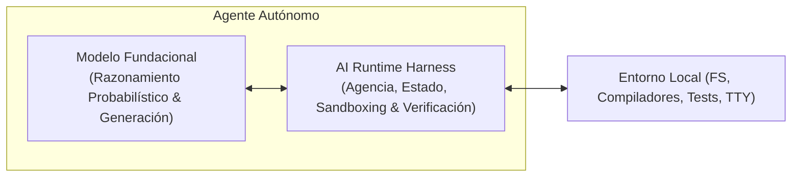

Formalmente, la relación operacional del sistema se define como:

$$\text{Agente} = \text{Modelo} + \text{Harness}$$

- **Modelo:** Provee inferencia probabilística, comprensión semántica y síntesis de código.
- **Harness:** Provee agencia operativa determinista, máquina de estados finitos, políticas de contención (sandboxing), memoria contextual y bucles de realimentación con compiladores y suites de prueba.

---

### 1.1. La Brecha de Autonomía (_Autonomy Gap_) y Taxonomía de Fallos

Sin un harness estructurado, los modelos de lenguaje sufren de la denominada **brecha de autonomía** (_autonomy gap_): la disparidad entre la capacidad local de emitir código sintácticamente plausible y la habilidad real de completar tareas de ingeniería de software complejas de extremo a extremo sin intervención humana.

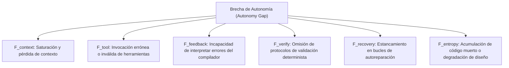

| Notación              | Tipo de Fallo                     | Manifestación Técnica                                                                           |
| :-------------------- | :-------------------------------- | :---------------------------------------------------------------------------------------------- |
| $F_{\text{context}}$  | **Pérdida de Contexto**           | Desbordamiento de la ventana de atención, alucinación de APIs y pérdida de directivas globales. |
| $F_{\text{tool}}$     | **Invocación Errónea**            | Violación de esquemas JSON, argumentos malformados o llamadas fuera de secuencia.               |
| $F_{\text{feedback}}$ | **Incompatibilidad de Feedback**  | Incapacidad de mapear trazas de error del compilador/linter a las líneas causales.              |
| $F_{\text{verify}}$   | **Omisión de Verificación**       | Conclusión prematura de tareas sin ejecución de pruebas unitarias ni análisis estático.         |
| $F_{\text{recovery}}$ | **Estancamiento en Recuperación** | Ciclos infinitos intentando corregir el mismo error sin alterar la estrategia.                  |
| $F_{\text{entropy}}$  | **Degradación Arquitectónica**    | Introducción de dependencias redundantes, código duplicado o violación de principios SOLID/DRY. |

---

### 1.2. Las 11 Responsabilidades Fundamentales del Harness

El harness opera como un **sustrato de ejecución en tiempo real** (_runtime substrate_) situado entre el LLM y el sistema operativo anfitrión. Se estructura en 11 subsistemas coordinados:

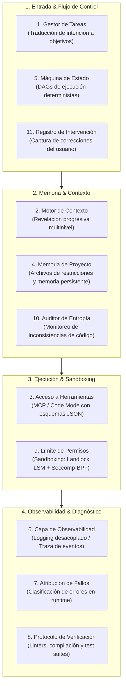

1. **Gestor de Especificación de Tareas:** Descompone la intención del usuario en especificaciones atómicas y verificables.
2. **Motor de Selección de Contexto:** Aplica revelación progresiva (_progressive disclosure_) para maximizar la densidad de información en la ventana de contexto.
3. **Superficie de Acceso a Herramientas:** Provee interfaces tipadas mediante el _Model Context Protocol_ (MCP) o entornos _Code Mode_.
4. **Memoria de Proyecto:** Persiste decisiones de arquitectura, reglas de estilo y restricciones del repositorio (`AGENTS.md`, `GEMINI.md`).
5. **Máquina de Estado de Tareas:** Gobierna la transición de estados mediante Grafos Dirigidos Acíclicos (DAGs).
6. **Capa de Observabilidad:** Registra cada invocación, token consumido y decisión en canales dedicados sin interferir con la terminal.
7. **Subsistema de Atribución de Fallos:** Clasifica fallos en runtime ($F_{\text{tool}}$, $F_{\text{feedback}}$, etc.) para aplicar tácticas de recuperación guiadas.
8. **Protocolo de Verificación:** Ejecuta de forma determinista suites de pruebas, linters y comprobaciones de tipos tras cada mutación.
9. **Límite de Permisos y Aislamiento (_Sandboxing_):** Impone el principio de mínimo privilegio sobre el sistema de archivos y llamadas al sistema.
10. **Auditor de Entropía:** Detecta desviaciones arquitectónicas, código muerto o degradación de la base de código.
11. **Registro de Intervenciones Humanas:** Almacena decisiones del desarrollador para ajustar bucles de realimentación futuros.

---

### 1.3. Desacoplamiento Arquitectónico en Entornos TUI

En una interfaz de usuario basada en terminal (TUI) como _OpenCode_, _Pi_ o _Zargeant_, el harness debe desacoplar estrictamente el ciclo de renderizado de las operaciones bloqueantes:

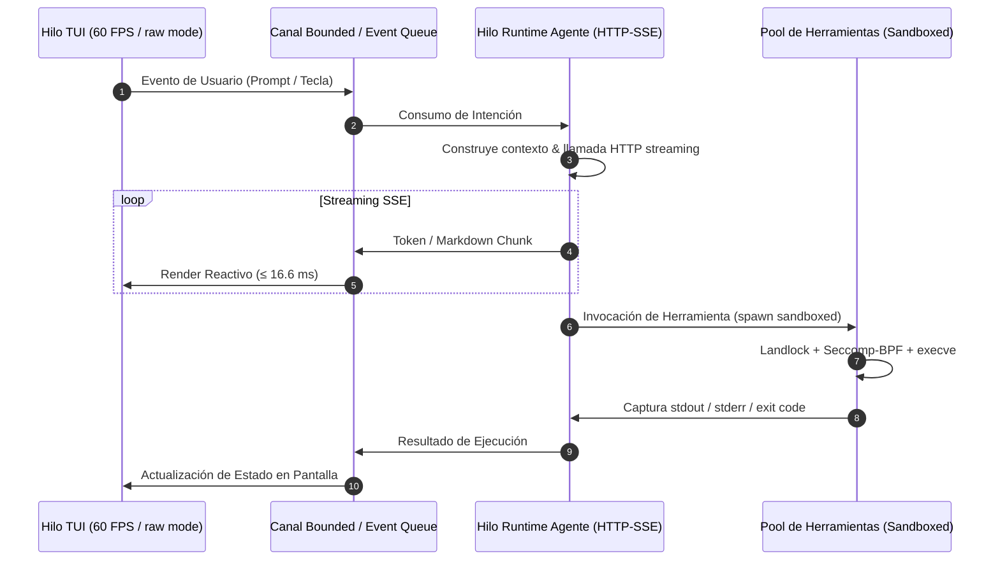

- **Hilo Principal (TUI):** Renderizado reactivo a $\ge 60$ FPS ($\le 16.6$ ms/cuadro). Cero I/O de disco o red bloqueante.
- **Hilos Secundarios (Runtime & Tools):** Conexiones HTTP asíncronas con modelos LLM y ejecución de subprocesos aislados en background.

---

## 2. Requisitos del Sistema (Formato SDD)

### 2.1. Requisitos Funcionales

| ID        | Subsistema                     | Descripción Funcional                                                                            | Criterio de Aceptación                                                                       |
| :-------- | :----------------------------- | :----------------------------------------------------------------------------------------------- | :------------------------------------------------------------------------------------------- |
| **RF-01** | **Gestión de Contexto**        | Indexación incremental del árbol del repositorio mediante análisis de AST y mapas de símbolos.   | Generación del mapa de símbolos en $\le 100$ ms tras cambios en el sistema de archivos.      |
| **RF-02** | **Superficie de Herramientas** | Soporte dinámico para servidores MCP y ejecución de herramientas en entornos aislados.           | Validación estricta de argumentos contra esquemas JSON antes de invocar el subproceso.       |
| **RF-03** | **Interfaz TUI**               | Renderizado reactivo y flujo continuo (_streaming_) de respuestas del LLM en formato Markdown.   | Tasa sostenida sin congelamiento de pantalla ni parpadeo (_flicker_) durante ráfagas de red. |
| **RF-04** | **Verificación en Bucle**      | Invocación automática de herramientas de validación estática y pruebas tras ediciones de código. | Inyección automática de errores del compilador en la siguiente ventana de inferencia.        |
| **RF-05** | **Control de Estado**          | Creación de puntos de restauración (_checkpoints_) mediante deltas de Git o parches internos.    | Reversión completa de modificaciones al estado previo a la tarea mediante un solo comando.   |

---

### 2.2. Requisitos No Funcionales

| ID         | Categoría                    | Métrica u Objetivo                                                          | Restricción Técnica                                                                  |
| :--------- | :--------------------------- | :-------------------------------------------------------------------------- | :----------------------------------------------------------------------------------- |
| **RNF-01** | **Rendimiento Visual**       | Tasa constante $\ge 60$ FPS ($\le 16.6$ ms por cuadro).                     | Hilo TUI sin llamadas a red, lecturas síncronas de disco ni bloqueos por cerrojos.   |
| **RNF-02** | **Consumo de Memoria**       | Huella base $\le 30$ MB en reposo; pico $\le 250$ MB en contextos extensos. | Implementación de buffers circulares y liberación proactiva de cachés inactivas.     |
| **RNF-03** | **Latencia de Arranque**     | Tiempo de arranque en frío (_cold start_) $\le 50$ ms.                      | Carga diferida (_lazy loading_) de submódulos de herramientas y conexiones externas. |
| **RNF-04** | **Aislamiento de Seguridad** | Confinamiento de subprocesos contra el sistema operativo anfitrión.         | Aplicación de filtros Seccomp-BPF y restricciones de rutas vía Landlock LSM.         |

---

## 3. Especificación Técnica e Implementación en Rust

Rust ofrece garantías formales de seguridad de memoria en tiempo de compilación mediante su sistema de tipos y _borrow checker_, junto a un ecosistema consolidado para aplicaciones de terminal asíncronas.

### 3.1. Evaluación de Componentes: Crates vs. Desarrollo Desde Cero

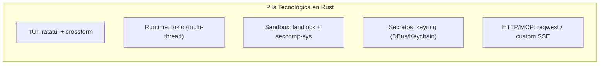

| Subsistema del Harness         | Crate Recomendado                | Alternativa _From Scratch_                                                        | Evaluación de Elección                                                                                                                                                |
| :----------------------------- | :------------------------------- | :-------------------------------------------------------------------------------- | :-------------------------------------------------------------------------------------------------------------------------------------------------------------------- |
| **Motor de Renderizado TUI**   | `ratatui` + `crossterm`          | Emisión manual de secuencias de escape ANSI sobre `/dev/tty`                      | **Utilizar Crate:** `ratatui` ofrece doble buffer, cálculo de recortes (_clipping_) y layouts reactivos altamente optimizados.                                        |
| **Runtime Asíncrono**          | `tokio`                          | Bucle de eventos propio implementado directamente con `mio` o `epoll`             | **Utilizar Crate:** `tokio` abstrae el reactor de I/O y el programador con arquitectura $M$-hilos sobre $N$-hilos con balanceo por robo de trabajo (_work-stealing_). |
| **Aislamiento (_Sandboxing_)** | `landlock` + `seccomp-sys`       | Invocación de llamadas al sistema mediante ensamblador o FFI manual               | **Enfoque Híbrido:** Reutilizar abstracciones seguras sobre Landlock y definir filtros Seccomp-BPF personalizados.                                                    |
| **Almacenamiento de Secretos** | `keyring`                        | Implementación manual de llamadas IPC a DBus (Linux) y Security Framework (macOS) | **Utilizar Crate:** `keyring` abstrae de manera segura los almacenes de credenciales nativos del sistema operativo.                                                   |
| **Protocolo HTTP / MCP**       | `reqwest` + `eventsource-stream` | Cliente HTTP/1.1 y HTTP/2 construido sobre `tokio::net::TcpStream`                | **Desde Cero / Ligero:** Diseñar un cliente HTTP minimalista enfocado en streaming SSE para erradicar dependencias transitivas pesadas.                               |

---

### 3.2. Arquitectura de Concurrencia y Bucle de Eventos

La arquitectura en Rust se articula alrededor de tres tareas asíncronas independientes sobre `tokio`, comunicadas mediante canales con capacidad acotada (_bounded channels_):

```rust
// Modelo conceptual de canales acotados en Rust
pub struct SystemChannels {
    pub ui_events: tokio::sync::mpsc::Sender<UiEvent>,
    pub agent_commands: tokio::sync::mpsc::Sender<AgentCommand>,
    pub tool_requests: tokio::sync::mpsc::Sender<ToolExecutionRequest>,
}
```

1. **Tarea de Interfaz de Usuario (Main Thread):**
    - Captura eventos de teclado/ratón vía `crossterm::event::EventStream`.
    - Recibe actualizaciones de estado desde el canal `mpsc::Receiver<UiEvent>` de forma no bloqueante.
    - Ejecuta el cálculo de widgets y renderizado mediante `ratatui::Terminal::draw`.
2. **Tarea del Runtime del Agente:**
    - Gobierna la máquina de estados, el historial de conversación y el cálculo de contexto.
    - Realiza peticiones HTTP vía streaming con decodificación continua de fragmentos SSE.
    - Envía eventos atómicos hacia la tarea de UI para renderizado en tiempo real.
3. **Tarea Ejecutora de Herramientas (_Tool Pool_):**
    - Administra un grupo de hilos dedicados para invocar procesos locales y servidores MCP.
    - Aplica perfiles de seguridad antes de ejecutar cualquier binario en el sistema anfitrión.

---

### 3.3. Gestión de Memoria y Propiedad de Datos

- **Compartición Cero-Copia:** Uso de `bytes::Bytes` y punteros de referencia atómica inmutables `Arc<str>` para transmitir fragmentos de texto del stream HTTP a la interfaz sin duplicar memoria.
- **Renderizado de Modo Inmediato:** `ratatui` reconstruye el árbol de widgets en cada cuadro. Se implementan **arenas de asignación a corto plazo** y **buffers circulares** (_ring buffers_) para logs y salidas de terminal, garantizando que el uso de memoria RAM permanezca acotado.

---

### 3.4. Aislamiento de Seguridad y Custodia de Credenciales

> [!CAUTION]
> La ejecución de código generado por modelos de lenguaje sin aislamiento representa un riesgo crítico de ejecución remota de comandos no autorizados o destrucción de datos del usuario.

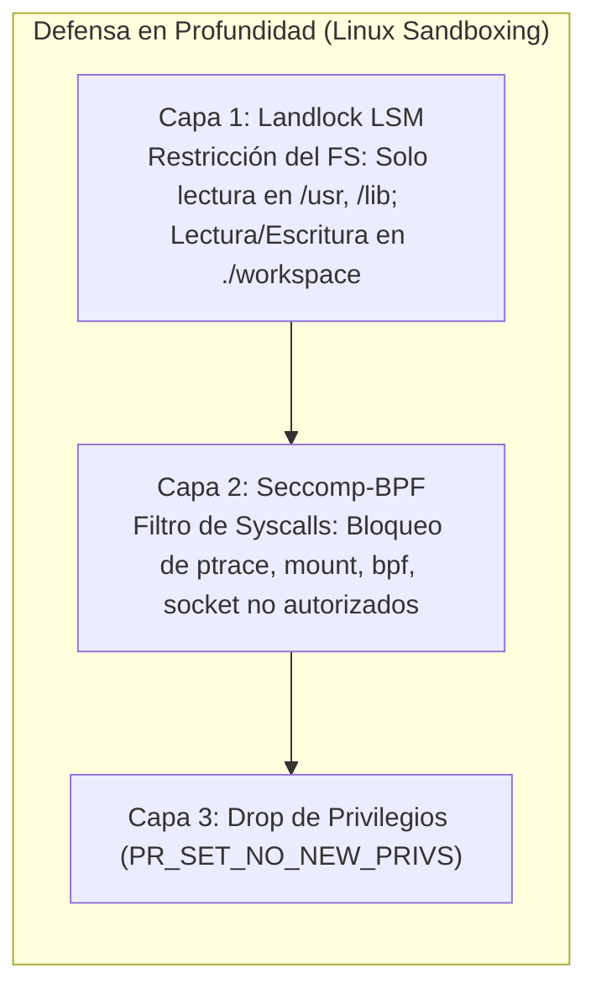

- **Linux Sandboxing:**
    1. _Landlock LSM:_ Confinamiento del sistema de archivos al directorio de trabajo del repositorio, bloqueando rutas críticas (`/etc`, `/home`, `/root`).
    2. _Seccomp-BPF:_ Restricción de llamadas al sistema, bloqueando la creación de interfaces de red no autorizadas, `ptrace` y operaciones de montaje.
- **macOS Sandboxing:** Confinamiento mediante `sandbox_exec` parametrizado con perfiles en lenguaje **SBPL** (_Seatbelt Sandbox Profile Language_).
- **Custodia de Secretos:** Delegación a `keyring` (Secret Service vía DBus en Linux, Keychain en macOS, Credential Manager en Windows).

---

## 4. Especificación Técnica e Implementación en Zig

Zig provee control determinista sobre los recursos de la máquina: ausencia de comportamiento oculto, gestión explícita de memoria mediante pasaje de asignadores (_allocator passing_), metaprogramación en tiempo de compilación (`comptime`) e interop nativa con el kernel de Linux y código C.

### 4.1. Evaluación de Módulos: Librerías vs. Desarrollo Desde Cero

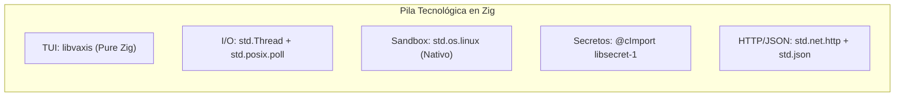

| Subsistema del Harness         | Módulo Recomendado              | Alternativa _From Scratch_                                            | Evaluación de Elección                                                                                                                                                   |
| :----------------------------- | :------------------------------ | :-------------------------------------------------------------------- | :----------------------------------------------------------------------------------------------------------------------------------------------------------------------- |
| **Motor de Renderizado TUI**   | `libvaxis`                      | Implementación manual del parser VT100/ANSI y manipulación TTY        | **Utilizar Librería:** `libvaxis` proporciona soporte Zig nativo para el protocolo Kitty Keyboard, renderizado sincronizado y TrueColor sin depender de `terminfo` ni C. |
| **Bucle de Eventos / I/O**     | `std.Thread` + `std.posix.poll` | Integración directa de `io_uring` o `epoll` mediante syscalls nativas | **Desde Cero:** La librería estándar de Zig contiene interfaces POSIX eficientes que permiten construir un reactor de I/O a medida sin sobrecarga.                       |
| **Aislamiento (_Sandboxing_)** | Directo vía `std.os.linux`      | Creación de un runtime de contenedores minimalista                    | **Desde Cero:** Invocar Landlock y Seccomp-BPF directamente en Zig elimina dependencias de C y otorga control total.                                                     |
| **Almacenamiento de Secretos** | Integración C vía `@cImport`    | Implementación desde cero de la pila del protocolo DBus               | **Enfoque Híbrido:** Importar directamente los encabezados de `libsecret-1` o APIs nativas del SO mediante las capacidades FFI de Zig.                                   |
| **Parsing HTTP / JSON**        | `std.net.http` + `std.json`     | Parser de tokens JSON personalizado con metaprogramación `comptime`   | **Utilizar `std`:** `std.net.http` y `std.json` en Zig proporcionan utilidades maduras con asignaciones de memoria estrictamente controladas.                            |

---

### 4.2. Arquitectura del Bucle de Eventos y Concurrencia

En lugar de un runtime asíncrono implícito con sobrecarga de estado, Zig implementa **subprocesos explícitos del sistema operativo** coordinados mediante colas de eventos libres de bloqueos (_lock-free queues_) o cerrojos livianos (`std.Thread.Mutex`):

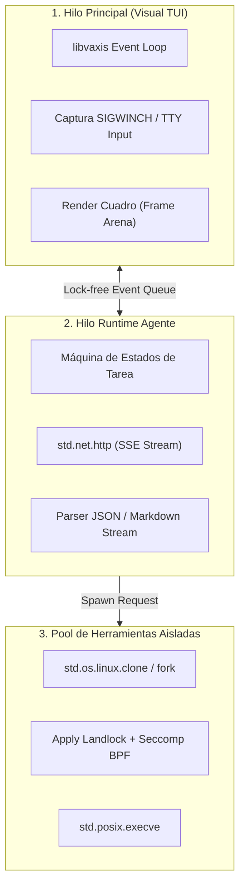

1. **Hilo Principal (Visual TUI):** Ejecuta el bucle de `libvaxis`, captura interrupciones del teclado, lecturas de la terminal y señales `SIGWINCH`, despachando eventos dentro de una unión etiquetada (_tagged union_):
    ```zig
    pub const SystemEvent = union(enum) {
        key_press: vaxis.Key,
        terminal_resize: vaxis.Winsize,
        stream_chunk: []const u8,
        tool_status: ToolStatus,
        agent_error: AgentError,
    };
    ```
2. **Hilo Secundario (Runtime del Agente):** Aloja la máquina de estados, gestiona conexiones HTTP mediante `std.net.http.Client`, parsea eventos SSE y encola fragmentos de texto hacia el hilo principal.
3. **Ejecución de Herramientas:** Engendra subprocesos aislados mediante la API de procesos de Zig, capturando flujos `stdout` y `stderr` sin bloquear la interfaz.

---

### 4.3. Gestión de Memoria y Patrones de Asignación

El principio fundamental de Zig —**cero asignaciones de memoria ocultas**— permite diseñar una arquitectura de asignadores con precisión milimétrica:

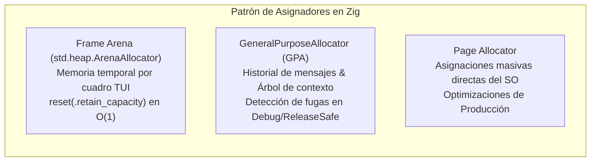

- **Arena de Cuadro (_Frame Arena_):** La capa visual utiliza un `std.heap.ArenaAllocator`. Durante el renderizado de cada cuadro, los cálculos temporales de cadenas y estilos consumen memoria de esta arena. Al volcar el cuadro al terminal, se invoca:
    ```zig
    _ = frame_arena.reset(.retain_capacity);
    ```
    Esto libera la memoria en tiempo constante $\mathcal{O}(1)$, erradicando cualquier fuga de memoria en la interfaz.
- **Memoria Persistente de Contexto:** Utiliza `std.heap.GeneralPurposeAllocator` (GPA) en desarrollo para verificar la ausencia de accesos inválidos (_use-after-free_), migrando a asignadores de página directa en compilaciones optimizadas.

---

### 4.4. Aislamiento de Seguridad y Custodia de Credenciales

Zig permite construir sandboxes embebidos directamente en el binario sin intermediarios C:

- **Espacios de Nombres (_Namespaces_):** Creación de entornos aislados de usuario, PID y montajes mediante `unshare(2)` o `clone(2)`.
- **Landlock LSM Nativo:**
    ```zig
    const ruleset_attr = std.os.linux.landlock_ruleset_attr{
        .handled_access_fs = LANDLOCK_ACCESS_FS_READ | LANDLOCK_ACCESS_FS_WRITE,
    };
    const fd = std.os.linux.landlock_create_ruleset(&ruleset_attr, @sizeOf(@TypeOf(ruleset_attr)), 0);
    ```
- **Seccomp-BPF con `comptime`:** Generación del bytecode de filtrado de syscalls en tiempo de compilación con metaprogramación Zig, reduciendo la superficie de ataque con cero sobrecarga en runtime.
- **Custodia de Credenciales:** Inclusión directa de cabeceras C del sistema sin abstracciones adicionales:
    ```zig
    const c = @cImport({
        @cInclude("libsecret/secret.h");
    });
    ```

---

## 5. Análisis Comparativo Transversal y Directrices de Implementación

### 5.1. Comparativa Cualitativa y Cuantitativa (Rust vs. Zig)

| Dimensión Técnica                     | Implementación en Rust                                          | Implementación en Zig                                              | Ventaja Técnica                |
| :------------------------------------ | :-------------------------------------------------------------- | :----------------------------------------------------------------- | :----------------------------- |
| **Tamaño del Binario Final**          | **5 MB a 15 MB** (con LTO, `panic=abort` y `strip`).            | **200 KB a 1.5 MB** (binario nativo mínimo sin runtime).           | **Zig** (x10 menor)            |
| **Tiempo de Arranque (_Cold Start_)** | **~15 ms a 40 ms** (inicialización de reactor Tokio).           | **< 5 ms** (arranque casi instantáneo).                            | **Zig** (Inmediatez)           |
| **Consumo Base de Memoria (RAM)**     | **~12 MB a 25 MB** (estado de hilos Tokio y buffers).           | **~2 MB a 8 MB** (control estricto con Frame Arenas).              | **Zig** (Eficiencia)           |
| **Madurez del Ecosistema TUI**        | **Alta:** `ratatui` posee gran catálogo de widgets.             | **Media:** `libvaxis` moderno pero requiere widgets a medida.      | **Rust** (Ecosistema)          |
| **Modelo de Concurrencia**            | Asíncrono (`async`/`await`) sobre _work-stealing scheduler_.    | Subprocesos explícitos del SO + colas _lock-free_.                 | **Empate técnico**             |
| **Seguridad de Memoria**              | Verificación estática formal en compilación (_Borrow Checker_). | Asignación manual explícita; validación GPA en runtime.            | **Rust** (Garantías estáticas) |
| **Simplicidad de Sandboxing**         | Requiere crates wrappers o bindings FFI C sobre Linux.          | Invocación nativa directa de syscalls del kernel (`std.os.linux`). | **Zig** (Integración kernel)   |

---

### 5.2. Mitigación de Vulnerabilidades de Agentes y Control del Entorno

La autonomía de los agentes introduce vectores de ataque específicos que deben neutralizarse en la capa del harness:

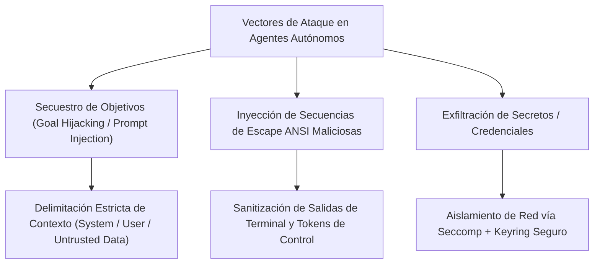

> [!WARNING]
> **Secuestro de Objetivos (_Goal Hijacking_):** Ocurre cuando un atacante inserta instrucciones maliciosas en comentarios de código, pull requests o documentación analizada por el agente.  
> **Estrategia de Mitigación:** Delimitación formal de bloques de contexto (`<system_instructions>`, `<untrusted_repo_content>`) y sanitización estricta de secuencias de escape de terminal antes del renderizado.

---

### 5.3. Arquitectura de Contexto Mediante Revelación Progresiva

Para evitar la saturación de la ventana de contexto ($F_{\text{context}}$), el harness estructura la inyección de información en **tres niveles jerárquicos de revelación progresiva** (_Progressive Disclosure_):

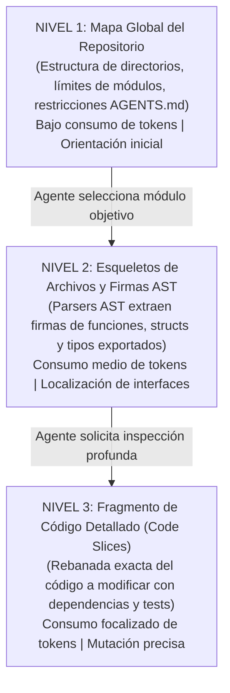

1. **Nivel 1 — Mapa Global del Repositorio:** Provee una vista panorámica del proyecto (árbol de directorios, módulos y restricciones de `AGENTS.md`) con consumo mínimo de tokens.
2. **Nivel 2 — Esqueletos y Firmas de Código:** Parsers AST extraen únicamente las firmas de funciones, estructuras y tipos públicos, omitiendo la implementación.
3. **Nivel 3 — Fragmento Detallado (_Code Slice_):** Inyecta únicamente el bloque de código a modificar junto con sus dependencias directas y pruebas unitarias asociadas.

---

## 6. Conclusiones y Recomendaciones Arquitectónicas

La especificación demuestra que la fiabilidad de los agentes de codificación autónomos reside en la **arquitectura del harness** y no exclusivamente en la capacidad del modelo fundacional.

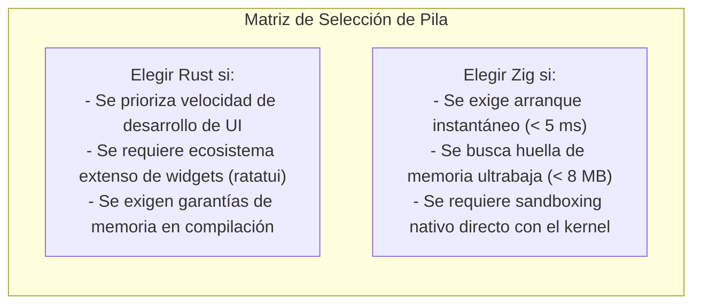

1. **Recomendación para Rust (`ratatui` + `tokio`):**
    - Ideal para herramientas orientadas a desarrolladores que requieren interfaces TUI sofisticadas con múltiples paneles interactivos y desarrollo rápido soportado en crates comunitarios.
2. **Recomendación para Zig (`libvaxis` + `std.os.linux`):**
    - Ideal para infraestructuras donde el rendimiento de arranque en frío, la huella de memoria imperceptible y el control directo de primitivas del kernel (Landlock, Seccomp) sin capas intermedias sean requisitos no negociables.

En ambas implementaciones, los tres pilares no negociables para un harness de nivel profesional son:

- **Verificación determinista en bucle cerrado** (ejecución automática de compilación y pruebas).
- **Aislamiento de seguridad multinivel** (Landlock LSM + Seccomp-BPF).
- **Administración de contexto por revelación progresiva** (3 niveles jerárquicos).
