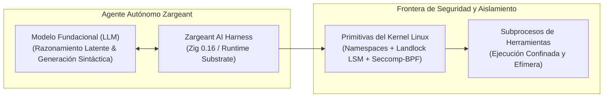
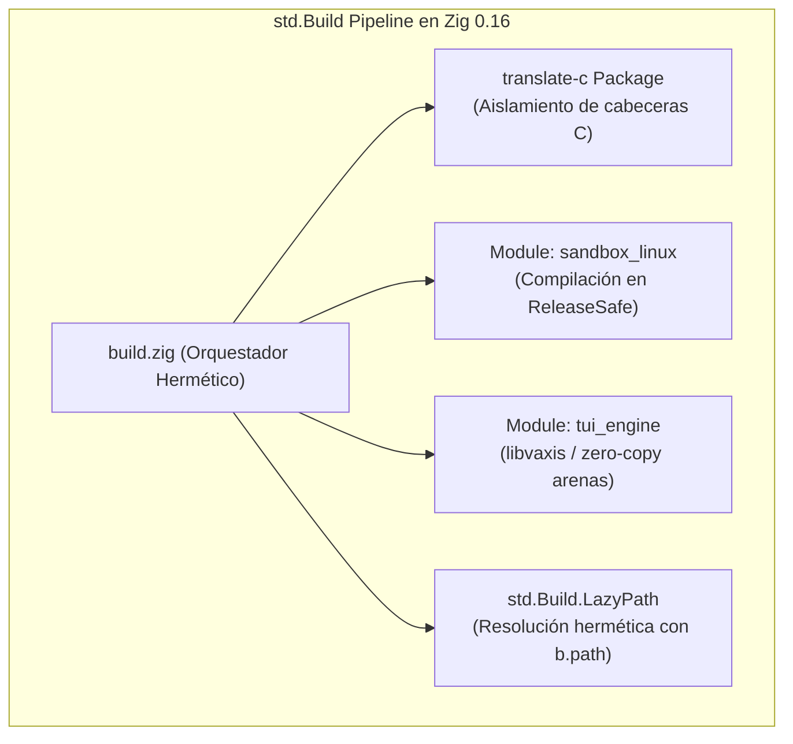
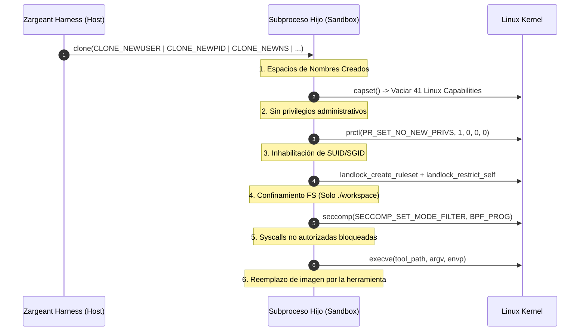
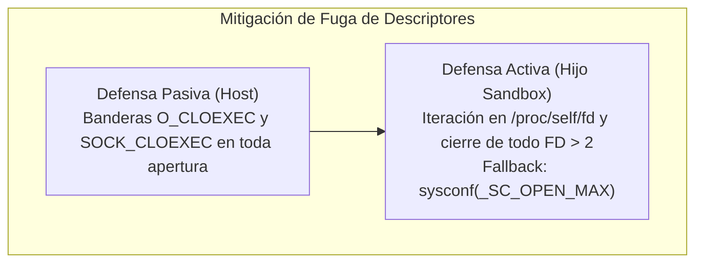
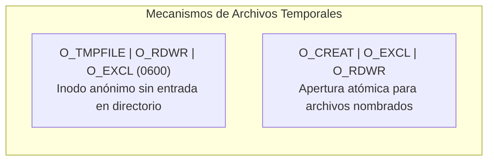
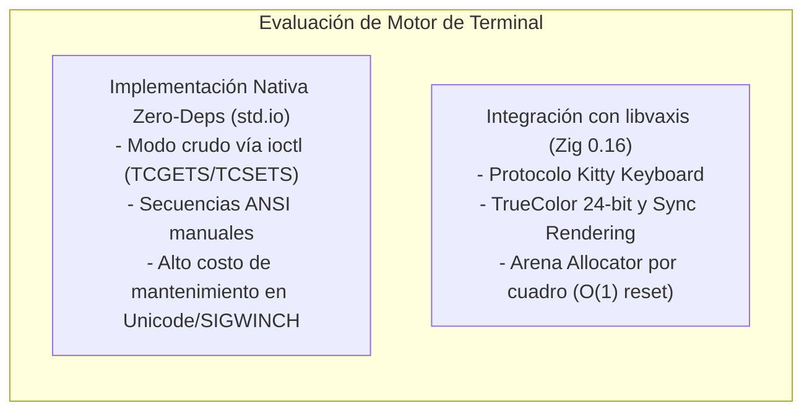

# Arquitectura y Seguridad del Harness de Agentes de IA Zargeant en Zig 0.16

## Aislamiento de Subprocesos en Linux, Sandboxing con Landlock/Seccomp y Conformidad POSIX/XDG

---

> [!NOTE]
> **Documento de Arquitectura y Especificación Técnica de Seguridad (SDD - Parte II)**  
> **Proyecto:** `zargeant` — AI Agent Harness TUI  
> **Plataforma:** Linux (Kernel $\ge 5.13$) | **Toolchain:** Zig `0.16.0`  
> **Pilares:** Confinamiento mediante Espacios de Nombres, Landlock LSM, Seccomp-BPF y Memoria Determinista.

---

## 1. Resumen Ejecutivo y Modelo de Amenazas

La evolución de la ingeniería de software asistida por inteligencia artificial ha desplazado el foco desde la optimización estática de instrucciones (_prompt engineering_) hacia la construcción de entornos de ejecución estructurados (**AI Agent Harnesses**).

La relación operacional fundamental entre el modelo y su infraestructura se sintetiza formalmente en la ecuación:

$$\text{Agente} = \text{Modelo} + \text{Harness}$$



- **Modelo:** Provee inferencia probabilística y síntesis de código.
- **Harness:** Constituye el sustrato operacional encargado de administrar el contexto, arbitrar el acceso a herramientas, persistir el estado del proyecto, canalizar la telemetría, aplicar políticas de seguridad y verificar de forma determinista los cambios introducidos.

> [!CAUTION]
> **Superficie de Ataque Crítica:** Al otorgar autonomía a un agente para mutar repositorios y ejecutar comandos de consola, el riesgo de ataques por inyección de instrucciones (_prompt injection_), secuestro de metas (_goal hijacking_), exfiltración de credenciales o corrupción accidental del sistema anfitrión aumenta de manera exponencial.

El proyecto **`zargeant`** se concibe como un harness de agentes de IA de alto rendimiento en **Zig 0.16.0** para Linux, diseñado para someter la ejecución de código no confiable a un aislamiento severo a nivel de hardware y kernel.

---

## 2. Matriz de Diagnóstico y Correcciones en Zig 0.16

El lanzamiento de Zig `0.16.0` introdujo cambios fundamentales en la semántica del compilador y en el sistema de construcción `std.Build`, destacando la eliminación formal del operador `@cImport` en archivos fuente en favor de la integración C gestionada mediante `translate-c` en `build.zig`. Asimismo, el orden de invocación de primitivas de seguridad en el kernel de Linux es estrictamente determinante.

### 2.1. Matriz Diagnóstica de Configuración de Build (`build.zig`)



| Aspecto Técnico / Módulo                        | Patrón Depreciado o Inseguro                                                                  | Refactorización Idiomática en Zig 0.16                                                                                                     | Impacto en Seguridad y Arquitectura                                                                                                             |
| :---------------------------------------------- | :-------------------------------------------------------------------------------------------- | :----------------------------------------------------------------------------------------------------------------------------------------- | :---------------------------------------------------------------------------------------------------------------------------------------------- |
| **Integración C (`translate-c`)**               | Invocación de `@cImport` en archivos fuente o uso de `std.Build.Step.TranslateC`.             | Declaración explícita del paquete `translate-c` en `build.zig` e importación mediante `b.addModule` o `b.createModule`.                    | Desacopla la compilación de cabeceras C de la fase de parseo del código Zig; aísla las fronteras ABI de las librerías del sistema.              |
| **Aislamiento de Módulos (`std.Build.Module`)** | Reúso indiscriminado de módulos entre el motor de orquestación y el ejecutable del sandbox.   | Creación hermética mediante `b.createModule()` asignando explícitamente `root_source_file`, `target` y `optimize`.                         | Impide que el código ejecutado en el entorno de sandbox pueda importar o resolver símbolos internos del harness.                                |
| **Inclusión de Rutas (`addIncludePath`)**       | Paso de cadenas de texto relativas crudas (`"../include"`) propensas a errores de resolución. | Utilización de `b.path("include")` que devuelve una instancia hermética de `std.Build.LazyPath`.                                           | Garantiza la reproducibilidad de la caché del compilador y elimina vectores de escalado de directorios en compilación.                          |
| **Perfil de Optimización**                      | Asignación global de `ReleaseFast` para todos los componentes de la aplicación.               | Diferenciación de perfiles: `ReleaseSafe` para el sandbox y el verificador; `ReleaseSmall`/`ReleaseFast` para motores estáticos auditados. | Mantiene activas las comprobaciones de desbordamiento de enteros, límites de arreglos y punteros nulos en runtime para el código de contención. |

---

### 2.2. Matriz de Secuencia Operativa y Aislamiento del Kernel (`sandbox_linux.zig`)



| Fase de Aislamiento                       | Antipatròn de Ordenación                                                                    | Orden Correcto de Invocación                                                                                | Primitiva del Kernel Enforzada                                                                                         |
| :---------------------------------------- | :------------------------------------------------------------------------------------------ | :---------------------------------------------------------------------------------------------------------- | :--------------------------------------------------------------------------------------------------------------------- |
| **1. Espacios de Nombres y Capacidades**  | Mantener capacidades POSIX activas tras la creación del _User Namespace_.                   | Invocación de `capset()` para vaciar completamente los conjuntos `effective`, `inheritable` y `permitted`.  | Vacía las 41 capacidades de Linux, eliminando privilegios antes de configurar el resto del entorno.                    |
| **2. Restricción de Elevación**           | Intentar cargar filtros Seccomp o aplicar Landlock sin marcar el hilo como no privilegiado. | Invocación de `prctl(PR_SET_NO_NEW_PRIVS, 1, 0, 0, 0)`.                                                     | Garantiza que llamadas `execve` subsecuentes no puedan adquirir privilegios mediante binarios SUID/SGID.               |
| **3. Aislamiento FS (Landlock LSM)**      | Aplicar filtros Seccomp antes de la configuración del árbol de directorios de Landlock.     | Ejecución secuencial de `landlock_create_ruleset`, `landlock_add_rule` y `landlock_restrict_self`.          | Delimita el acceso al sistema de archivos antes de que Seccomp bloquee las syscalls necesarias para configurar reglas. |
| **4. Filtrado de Syscalls (Seccomp-BPF)** | Cargar Seccomp al inicio del proceso padre o permitir syscalls de control en el hijo.       | Carga del programa BPF mediante `seccomp(SECCOMP_SET_MODE_FILTER, ...)` como último paso previo a `execve`. | Intercepta y bloquea syscalls no autorizadas (`ptrace`, `kexec_load`, `unshare`) a velocidad nativa del kernel.        |
| **5. Higiene de Descriptores**            | Herencia implícita de la tabla de descriptores de archivos del proceso harness.             | Limpieza activa mediante lectura de `/proc/self/fd` o aplicación universal de `O_CLOEXEC` / `SOCK_CLOEXEC`. | Cierra de forma atómica sockets de red, archivos de configuración e IPCs internos antes de ceder el control al agente. |

---

## 3. Análisis Profundo de Vulnerabilidades y Mitigaciones Técnicas

### Eje 1: Sistema de Construcción y Hermeticidad en Zig 0.16

El diseño del sistema de construcción en `zargeant` garantiza que los límites de compilación coincidan de forma estricta con las fronteras de seguridad del runtime.

```zig
// Fragmento arquitectónico en build.zig (Zig 0.16)
const std = @import("std");

pub fn build(b: *std.Build) void {
    const target = b.standardTargetOptions(.{});

    // Perfil estricto para el subsistema de seguridad
    const optimize_sandbox = .ReleaseSafe;

    const sandbox_mod = b.createModule(.{
        .root_source_file = b.path("src/sandbox_linux.zig"),
        .target = target,
        .optimize = optimize_sandbox,
    });

    const exe = b.addExecutable(.{
        .name = "zargeant",
        .root_module = b.createModule(.{
            .root_source_file = b.path("src/main.zig"),
            .target = target,
            .optimize = b.standardOptimizeOption(.{}),
        }),
    });
    exe.root_module.addImport("sandbox", sandbox_mod);
}
```

1. **Traducción C Hermética:** La eliminación de `@cImport` en favor de `translate-c` en `build.zig` previene la contaminación del espacio de nombres global del compilador. Las estructuras C se exponen como módulos aislados de Zig, impidiendo que el código del subproceso acceda a tipos o funciones auxiliares del motor de orquestación.
2. **Resolución de Rutas con `LazyPath`:** El uso de `b.path()` resuelve las rutas de cabeceras de forma relativa a la raíz del paquete de construcción, eliminando vectores de ataque basados en traversado de directorios (_directory traversal_).
3. **Compilación en `ReleaseSafe` para Seguridad:** Mientras que `ReleaseFast` elimina comprobaciones para maximizar ciclos de reloj, `ReleaseSafe` es mandatorio para `sandbox_linux.zig`. Conserva las aserciones en runtime contra desbordamientos aritméticos, índices fuera de rango e invalidación de punteros sin la sobrecarga de depuración completa.

---

### Eje 2: Sandboxing en Linux y Aislamiento de Subprocesos

#### Orden de Ejecución Crítico para Menor Privilegio

El aislamiento de subprocesos en Linux exige una ordenación estricta de llamadas al sistema previa a la invocación de `execve`:

```text
+-----------------------------------------------------------------------------------+
| 1. clone() / unshare()  --> Namespaces: User, PID, Mount, IPC, UTS               |
| 2. capset()             --> Vaciado total de Linux Capabilities (41 caps a 0)     |
| 3. prctl()              --> Activación obligatoria de PR_SET_NO_NEW_PRIVS        |
| 4. Landlock LSM         --> Confinamiento FS (landlock_restrict_self)            |
| 5. Seccomp-BPF          --> Carga del filtro de syscalls (SECCOMP_SET_MODE_FILTER)|
| 6. execve()             --> Reemplazo de imagen por la herramienta del agente     |
+-----------------------------------------------------------------------------------+
```

1. **Espacios de Nombres (`clone`/`unshare`):** Se instancia el subproceso con `CLONE_NEWUSER`, `CLONE_NEWPID`, `CLONE_NEWNS`, `CLONE_NEWIPC` y `CLONE_NEWUTS`.
2. **Vaciado de Capacidades (`capset`):** El hijo elimina todas las capacidades POSIX en sus conjuntos _effective_, _permitted_ e _inheritable_.
3. **Inhabilitación de Elevación (`PR_SET_NO_NEW_PRIVS`):** Requerido biunívocamente por el kernel antes de invocar Landlock o Seccomp, garantizando que futuras llamadas a `execve` no hereden bits SUID/SGID.
4. **Restricción del Sistema de Archivos (Landlock LSM):** Se instancia `landlock_create_ruleset()` y `landlock_restrict_self()`. Debe anteceder a Seccomp; si se invirtiera, el filtro Seccomp bloquearía las syscalls de configuración de Landlock.
5. **Filtrado de Syscalls (Seccomp-BPF):** Se carga el bytecode BPF como último cerrojo antes de `execve`, bloqueando syscalls como `ptrace`, `kexec_load` y `mount`.

---

#### Mitigación de Fuga de Descriptores de Archivos (_FD Leakage_)



- **Defensa Pasiva (Host):** Todos los descriptores instanciados por el proceso harness anfitrión aplican las banderas `O_CLOEXEC` o `SOCK_CLOEXEC`.
- **Defensa Activa (Pre-`execve` en Hijo):** El subproceso recorre `/proc/self/fd` cerrando todo descriptor $> 2$ (preservando únicamente `stdin`, `stdout` y `stderr`). Si `/proc` está restringido, se itera deterministamente hasta `sysconf(_SC_OPEN_MAX)`.

---

#### Manejo de Memoria Post-`clone`

> [!WARNING]
> Al invocar `clone` con `CLONE_VM` o `vfork`, el proceso hijo comparte el espacio de direcciones virtuales con el padre. **Está estrictamente prohibido realizar asignaciones dinámicas en el heap (`std.mem.Allocator`) dentro del contexto hijo post-clone**, ya que esto causa corrupción del heap o bloqueos mutuos (_deadlocks_) con mutexes capturados por otros hilos.

**Regla Arquitectónica:**

- La pila de ejecución del hijo se preasigna en el proceso padre.
- En el cuerpo del hijo post-clone únicamente se admiten variables locales en la pila y llamadas directas a primitivas del kernel mediante `std.os.linux`.

---

### Eje 3: Seguridad del Sistema de Archivos y Conformidad POSIX/XDG

#### Rutas Fijas en `/tmp` y Ataques TOCTOU / Symlink

El almacenamiento de archivos en rutas predecibles de `/tmp` expone al sistema a condiciones de carrera (_Time-of-Check to Time-of-Use_) y secuestro por enlaces simbólicos.



1. **Uso de `O_TMPFILE`:** Para buffers efímeros, se invoca `open()` con `O_TMPFILE | O_RDWR | O_EXCL` y permisos `0600`. El kernel genera un inodo anónimo sin entrada en el árbol de directorios que se libera automáticamente al cerrarse.
2. **Creación Atómica con `O_EXCL`:** Para archivos nombrados, se exige `O_CREAT | O_EXCL | O_RDWR`, abortando atómicamente si la ruta ya existía.

#### Jerarquía del Estándar XDG Base Directory

```text
/
├── run/user/$UID/zargeant/        <-- XDG_RUNTIME_DIR (Permisos 0700: Sockets IPC efímeros)
└── $HOME/
    ├── .local/share/zargeant/     <-- XDG_DATA_HOME (Persistencia de estados de tareas y artefactos)
    └── .config/zargeant/          <-- XDG_CONFIG_HOME (Permisos 0600: Políticas Seccomp y configs)
```

- **`XDG_RUNTIME_DIR` (`/run/user/UID/zargeant`):** Permisos `0700`. Canales de control IPC efímeros e intercomunicación de subprocesos.
- **`XDG_DATA_HOME` (`~/.local/share/zargeant`):** Persistencia de memorias de proyecto, DAGs de tareas y checkpoints de Git.
- **`XDG_CONFIG_HOME` (`~/.config/zargeant`):** Lectura inmutable de configuraciones y perfiles Landlock/Seccomp.

#### Alternativas Idiomáticas de Registro (_Logging_) en Linux

1. **Integración con `systemd-journald`:** Envío de datagramas estructurados al socket `/run/systemd/journal/socket` con pares clave-valor (`PRIORITY=3`, `SYSLOG_IDENTIFIER=zargeant`, `BLOCKED_SYSCALL=sys_ptrace`).
2. **Tuberías No Bloqueantes (`O_NONBLOCK`):** Los flujos `stdout` y `stderr` del subproceso se canalizan mediante pipes no bloqueantes hacia la capa de observabilidad sin congelar el hilo principal.

---

### Eje 4: Arquitectura TUI Zero-Deps vs. `libvaxis`



| Criterio de Selección        | Implementación Nativa Zero-Deps (`std.io`)                               | Integración con `libvaxis` (Zig 0.16)                                             | Veredicto Técnico             |
| :--------------------------- | :----------------------------------------------------------------------- | :-------------------------------------------------------------------------------- | :---------------------------- |
| **Modelo de Memoria**        | Búferes manuales mediante asignadores estáticos o globales.              | Arena Allocator por cuadro (`ctx arena`) con liberación total en cada redibujado. | **`libvaxis`** (Cero fugas)   |
| **Detección de Capacidades** | Basada estáticamente en variable `TERM`; propensa a fallos.              | Consultas dinámicas sobre el canal TTY (Kitty Keyboard, Sync, TrueColor).         | **`libvaxis`** (Moderno)      |
| **Bucle de Eventos**         | Bucle de lectura manual bloqueante o integración directa con `epoll`.    | Bucle de eventos seguro entre hilos (`vaxis.Loop`) con gestión nativa de señales. | **`libvaxis`** (Concurrencia) |
| **Mantenibilidad**           | Elevada carga de mantenimiento para layouts, texto enriquecido y scroll. | Abstracción de ventanas lógicas (`win.child`), componentes y widgets reusables.   | **`libvaxis`** (Modular)      |
| **Superficie de Seguridad**  | Mínima (limitada al código propio de la aplicación).                     | Reducida; código Zig puro, sin dependencias C opacas en el grafo de compilación.  | **Empate** (Ambos FOSS puros) |

**Conclusión:** Se ratifica la adopción de **`libvaxis`** para `zargeant`. Provee soporte nativo para protocolos modernos de terminal y garantiza la ausencia de fugas de memoria gracias a su patrón de asignación por arena.

---

### Eje 5: Matriz de Depuración, Sanitizadores y Tooling de Diagnóstico

#### Configuración de Sanitizadores en `build.zig`

- **AddressSanitizer (ASan):** Detecta accesos fuera de límites (_out-of-bounds_), uso de memoria liberada (_use-after-free_) y fugas en bloques nativos.
- **ThreadSanitizer (TSan):** Audita condiciones de carrera (_data races_) en estructuras compartidas entre el hilo TUI y el monitor del sandbox.
- **UndefinedBehaviorSanitizer (UBSan):** Habilitado intrínsecamente en `ReleaseSafe` para abortar ante operaciones aritméticas no válidas o punteros desalineados.

#### Auditoría de Syscalls y Confinamiento de Volcados (_Coredumps_)

```bash
# Comando de rastreo de subprocesos aislados con resolución de FDs
strace -f -p <PID> -e trace=process,file,network -y -yy
```

1. **Bandera `SECCOMP_FILTER_FLAG_LOG`:** Activa el registro en `dmesg`/`journalctl` de toda syscall interceptada que no coincida con `SECCOMP_RET_ALLOW`, facilitando la calibración del filtro.
2. **Inhabilitación de Volcados de Memoria (_Coredumps_):**
    ```zig
    // Previene la extracción de claves de API en memoria ante colapsos provocados
    _ = std.os.linux.prctl(std.os.linux.PR.SET_DUMPABLE, 0, 0, 0, 0);
    ```

---

## 4. Referencias Oficiales y Bibliografía Técnica

1. **SecureFlag:** _Harness Engineering: Secure AI Coding Architecture and Design Principles_.
2. **OpenAI & Research Community:** _AI Harness Engineering: A Runtime Substrate for Foundation-Model Software Agents_.
3. **Fowler, Martin:** _Exploring Gen AI: Harness Engineering Memo_.
4. **Skelf Research:** _ZViz Runtime Specification: High-Performance Linux Sandboxing with Landlock and Seccomp-BPF in Zig_.
5. **Linux Kernel Organization:** Manual Pages: `landlock(7)`, `seccomp(2)`, `prctl(2)`, `clone(2)`, `open(2)`.
6. **Zig Software Foundation:** _Zig Language & Build System Documentation (v0.16.0)_.
7. **Vaxis Development Team:** _libvaxis: Modern Terminal User Interface Library for Zig_.
