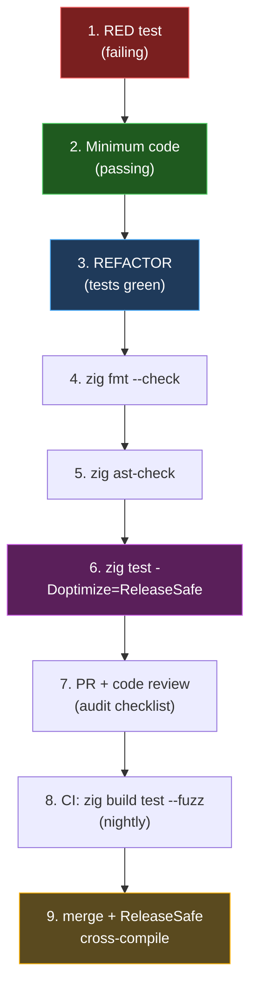

# Methodology — Strict TDD + QA Layers + Zig 0.16 Best Practices

> **Audience:** Contributors to `zargeant` (Zig 0.16 AI Agent Harness).
> **Status:** Canonical reference. Updated when the workflow or toolchain changes.
> **Companion docs:** [`investigation-2.md`](./investigation-2.md) (security architecture and isolation order), [`decisions/0001-libvaxis-to-mibu.md`](./decisions/0001-libvaxis-to-mibu.md) (TUI library selection).

---

## 1. The split: TDD vs QA

`zargeant` enforces two complementary disciplines. They are **not** the same thing.

| Dimension | Strict TDD | QA |
|---|---|---|
| **When** | Before code | After code |
| **What it proves** | Expected behavior | Correctness under unknown conditions |
| **Author** | The developer | Developer, tools, auditors |
| **Captures** | Logic, contracts, regressions, design flaws | Memory safety, races, sandbox escapes, adversarial inputs |
| **In zargeant** | "the isolation order is X" | "the BPF filter resists `ptrace`" |

**Rule of thumb:** TDD verifies what you **know**. QA verifies what you **don't know**.

This is why both coexist for security-critical code: TDD encodes your intent (e.g., the isolation order: `caps → no-new-privs → landlock → seccomp → execve`). But proving that the BPF filter actually resists a real `ptrace` requires a manual pen-test, not a unit test.

---

## 2. Strict TDD in Zig 0.16

### The cycle

```
RED → GREEN → REFACTOR
```

- **RED**: Write a failing test **before** any production line.
- **GREEN**: Minimum code to pass.
- **REFACTOR**: Clean up while tests stay green.

If the test didn't fail before the code, it isn't TDD.

### Concrete example: enforcing the isolation order

```zig
// tests/sandbox_linux_order_test.zig
const std = @import("std");
const testing = std.testing;
const sandbox = @import("src/sandbox_linux.zig");

test "sandbox: isolation order is caps → no-new-privs → landlock → seccomp" {
    var recorder = MockSyscallRecorder.init(testing.allocator);
    defer recorder.deinit();

    try sandbox.setupIsolation(&recorder, .{});

    // 1. capset() MUST be the first call
    try testing.expectEqual(Syscalls.capset, recorder.calls[0]);

    // 2. PR_SET_NO_NEW_PRIVS before landlock AND seccomp
    const prctl = recorder.find(.prctl_no_new_privs).?;
    const landlock = recorder.find(.landlock_restrict_self).?;
    const seccomp = recorder.find(.seccomp_set_mode_filter).?;

    try testing.expect(prctl < landlock);
    try testing.expect(prctl < seccomp);

    // 3. Seccomp MUST be the last call before execve
    try testing.expectEqual(recorder.calls.len - 1, seccomp);
}
```

### Hard rules for TDD in Zig

1. **Test RED first.** No production lines without a failing test.
2. **One test, one behavior.** Don't mix "drop caps" with "block ptrace".
3. **`std.testing.allocator` in every test that allocates.** Any leak → fail with `leak`.
4. **Mock syscalls.** Don't exercise the real kernel in unit tests; use a recorder/fake.
5. **`expectError` for every `error.X`.** Cover error paths explicitly.
6. **`refAllDecls(@This())` in zontest.** Forces compilation of every declaration.
7. **Co-located tests.** `test "..."` blocks live in the same `.zig` file as the code.
8. **Table-driven tests** for variants (with/without namespaces, distinct BPF filters).

### Work-unit granularity

Each commit implements one work unit. A work unit is:

- A single behavior (one test, one production change).
- Cyclable through RED → GREEN → REFACTOR in one sitting.
- Reviewable as a single diff (≤ ~60 production lines, ≤ ~150 test lines).

Work units compose into slices. A slice is a coherent feature across multiple work units.

---

## 3. QA Layers

| # | Layer | Tool / Command | When |
|---|---|---|---|
| 1 | Static | `zig fmt --check src/`<br>`zig ast-check src/`<br>`zig build check` (wrapper that runs both) | Every push |
| 2 | Runtime | `zig build test -Doptimize=ReleaseSafe` | Every push |

> **Note (TSan not wired):** A `zig build test-tsan` step (ReleaseSafe + `-fsanitize-thread`) is documented but **not wired** in `build.zig`. Reason: Zig 0.16's bundled `libtsan` (`lib/std/libtsan/`) references `<linux/scc.h>`, which the kernel removed in 5.15 — compilation fails on Arch/CachyOS/nix with recent kernels. Track upstream fix (Zig 0.16.1+); meanwhile use `valgrind --tool=helgrind` as a fallback for race detection on the test binary.
| 3 | Fuzz | `zig build test --fuzz[=limit]` (built-in fuzzer, web UI in 0.14+) | Nightly |

> **Note:** The fuzzer only runs tests marked with fuzz-friendly signatures (e.g., `test "fuzz: name"` consuming `std.testing.fuzzInput()`). Standard `test "..."` blocks pass through normally and do not trigger fuzz input. Add a fuzz-marked test for any surface that accepts untrusted input (parsers, hash parsers, JSON decoders). For zargeant, this applies to the BPF filter builder and `Seccomp.buildAllowlist`.
| 4 | Integration | VM smoke + `strace -f -e trace=process,file -y -yy` | **NOT ADOPTED** — see §8 |
| 5 | Audit | Code review against audit checklist in §3 | Pre-merge |
| 6 | Pen-test | Manual: `ptrace(PTRACE_TRACEME, ...)` from sandbox, exfiltration via `/proc/self/environ` | **NOT ADOPTED** — see §8 |

### Sanitizers enabled in `ReleaseSafe`

- **ASan** — out-of-bounds, use-after-free, native-block leaks.
- **UBSan** — invalid arithmetic, misaligned pointers, illegal casts.
- **TSan** — data races on shared structures (TUI thread ↔ sandbox monitor).

`zig build test -Doptimize=ReleaseSafe` already triggers them; no extra flags needed.

### Pre-merge audit checklist (security-critical code)

- [ ] Syscall order: `caps → no-new-privs → landlock → seccomp → execve`.
- [ ] `O_CLOEXEC` (file: `.{ .CLOEXEC = true }`) / `SOCK_CLOEXEC` (socket: `| std.os.linux.SOCK.CLOEXEC`) on every descriptor opened by the host.
- [ ] Pre-`execve` FD sweep closes everything `> 2`.
- [ ] Ephemeral buffers: `.{ .TMPFILE = true, .EXCL = true, .DIRECTORY = true, .CLOEXEC = true }`.
- [ ] Named files: `.{ .CREAT = true, .EXCL = true, .ACCMODE = .RDWR, .CLOEXEC = true }`.
- [ ] `XDG_RUNTIME_DIR` (0700) used for IPC sockets.
- [ ] `std.os.linux.PR.SET_DUMPABLE` (enum) before loading secrets — not magic number `4`.
- [ ] `ReleaseSafe` build profile for `sandbox_linux.zig`.

---

## 4. Zig 0.16 Best Practices

### 4.1 Memory

- `std.heap.GeneralPurposeAllocator` (GPA) in `main` for dev. **Catches leaks, use-after-free, double-free.**
- `std.heap.ArenaAllocator` for batch/scoped (TUI frames, parse trees). **Reset total per cycle.**
- `std.heap.page_allocator` for one-shot.
- `std.heap.FixedBufferAllocator` for stack-only.
- `errdefer` on every error path; `defer` immediately after a successful allocation.

### 4.2 Errors

- Typed error sets (`error{Name}`), **never `anyerror`** — testing can't force errors against it.
- `!T` for fallible. `try` for propagation. `catch` for handling.
- Coercion: `error{X} => error{Y}`.
- `unreachable` only with a static proof; document the rationale.

### 4.3 Build (`build.zig`)

- `b.path()` instead of raw strings. Hermetic path resolution.
- `b.dependency()` for externals; `b.addModule()` for internals.
- `build.zig.zon` requires Blake3 hash on every dependency.
- `ReleaseSafe` for code that handles untrusted input (sandbox, parsers).
- `ReleaseFast` for audited hot paths (TUI renderer, IPC).

### 4.4 Zig 0.16 specifics (vs 0.13/0.14)

- **`@cImport` removed** → `translate-c` declared in `build.zig`.
- `std.os.linux` direct for critical syscalls.
- `comptime` for genericity over runtime dispatch.
- `const` by default; `var` only when mutation is necessary.
- `std.ArrayListUnmanaged` for fields that should not carry an allocator.
- **`O_*` file-open flags are packed struct bool fields**, not integer constants. The bitwise `|` operator does NOT work on them. Use struct literal syntax: `.{ .CLOEXEC = true, .TMPFILE = true, .EXCL = true }`. Source: `lib/std/os/linux.zig:310-333`. **Socket flags (`SOCK.CLOEXEC`, `SOCK.NONBLOCK`) remain integer constants** — `|` is still valid there.

### 4.5 Security (zargeant-specific)

- `std.os.linux.PR.SET_DUMPABLE` before loading secrets (enum, not magic number `4`).
- `O_CLOEXEC` / `SOCK_CLOEXEC` on every open. **Zig 0.16 syntax:**
  ```zig
  // File open (packed struct bool)
  .{ .CLOEXEC = true }
  // Socket (integer constant — bitwise OR still works)
  std.os.linux.SOCK.STREAM | std.os.linux.SOCK.CLOEXEC
  ```
- **Ephemeral buffers** (anonymous inode, no directory entry):
  ```zig
  .{ .TMPFILE = true, .EXCL = true, .DIRECTORY = true, .CLOEXEC = true, .ACCMODE = .RDWR }
  ```
- **Named files** (atomic creation):
  ```zig
  .{ .CREAT = true, .EXCL = true, .ACCMODE = .RDWR, .CLOEXEC = true }
  ```
- **Non-blocking log pipes**:
  ```zig
  .{ .NONBLOCK = true, .CLOEXEC = true }
  ```
- `XDG_RUNTIME_DIR` (0700) for IPC sockets.

### 4.6 API conventions

- Slices > raw pointers.
- `std.meta` for introspection.
- `std.ArrayListUnmanaged` for fields that should not commit to an allocator.
- **Zero macros** — `comptime` + regular functions instead.
- Comments explain **why**, not **what**.

### 4.7 Documentation

- `///` for public docs (exported to `.docs.json`).
- `//!` for module-level docs.
- `ponytail:` to mark deliberately simplified code with a known ceiling.

---

## 5. Combined Workflow



| Step | Phase | Tool | Owner |
|---|---|---|---|
| 1 | TDD RED | `zig test` | Developer |
| 2 | TDD GREEN | `zig test` | Developer |
| 3 | TDD REFACTOR | `zig fmt` + `zig test` | Developer |
| 4 | QA static | `zig fmt --check src/` | Developer |
| 5 | QA static | `zig ast-check src/` | Developer |
| 6 | QA runtime | `zig test -Doptimize=ReleaseSafe` | CI |
| 7 | QA audit | Manual review vs checklist (§3) | Reviewer |
| 8 | QA deep | `zig build test --fuzz` (nightly) | CI nightly |
| 9 | QA binary | `ReleaseSafe` cross-compile | CI |

The TDD layer (1-3) is what you **add** to the existing flow. The current `zls → zig ast-check → zig test → ReleaseSafe` pipeline covers QA 1+2; the methodology adds QA 3 (fuzz, nightly) and 5 (audit) as wired steps. QA 4 (VM integration) and 6 (pen-test) are **documented but not adopted** — see §8.

---

## 6. Anti-patterns

1. **TDD without RED** — tests that don't fail before the code.
2. **Tests coupled to implementation** — break on every refactor.
3. **`anyerror` everywhere** — testing can't force specific errors.
4. **`unreachable` as laziness** — breaks invariants in production.
5. **Fuzzing without seeds** — non-reproducible results.
6. **Sanitizers only in Debug** — they don't catch `ReleaseFast` binaries.
7. **Audit without checklist** — obvious catches slip through.
8. **TDD without `errdefer`** — leaks pass the green test.
9. **Skipping `refAllDecls`** — dead declarations survive in `ReleaseSafe`.
10. **Stack allocation in post-`clone` child** — corrupts the parent's heap (see `investigation-2.md` §3, Eje 2).
11. **Bitwise OR on `O_*` flags** — `O_TMPFILE | O_EXCL` does not compile in 0.16. Use struct literals: `.{ .TMPFILE = true, .EXCL = true }`. Socket flags (`SOCK.CLOEXEC`) remain integer constants.

---

## 7. Adoption scope (NOT adopted)

The following layers are documented but **not adopted** in this project's current workflow:

| Layer | Reason |
|---|---|
| **QA 4 — Integration in VM** | Setup cost (4-8h) outweighs incremental value. The kernel primitives (Landlock, Seccomp) are exercised naturally when running `zargeant` in a real shell. `strace` is available on demand. |
| **QA 6 — Pen-test** | Reserved for pre-release. The threat model in [`investigation-2.md` §3](./investigation-2.md) is the framework. Manual pen-test runs ~8-16h per release cycle. |
| **AFL++ / external fuzzer** | Zig 0.14+ has a built-in fuzzer (`zig build test --fuzz`) with code coverage and web UI. External fuzzer is YAGNI. |

Re-evaluate this scope when: (a) the project gains a real user base that needs VM-tested binaries, (b) a release cadence exceeds one per quarter, or (c) the threat model expands to cover new attack surfaces.

---

## 8. References

- [`investigation-2.md`](./investigation-2.md) — security architecture, isolation order, kernel primitives.
- [`decisions/0001-libvaxis-to-mibu.md`](./decisions/0001-libvaxis-to-mibu.md) — TUI library selection rationale.
- [Zig 0.16 Language Reference](https://ziglang.org/documentation/0.16.0/) — `std.testing`, `std.heap`, `std.os.linux`.
- [Linux man-pages](https://man7.org/linux/man-pages/) — `landlock(7)`, `seccomp(2)`, `prctl(2)`, `clone(2)`, `open(2)`.

---

**Maintenance:** Propose changes via PR. Update version note when Zig minor or major changes.
**Owner:** all contributors.
